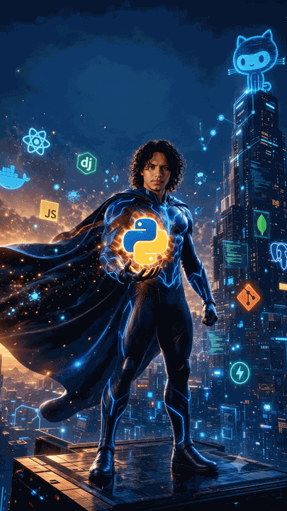

<picture>
  <source media="(prefers-color-scheme: dark)" srcset="dark.svg">
  <source media="(prefers-color-scheme: light)" srcset="light.svg">
  
</picture>

<!-- ============ HERO ============ -->

# Hedayat Ali

### Software Developer · Full Stack Developer · Python Developer

**Turning complex problems into elegant, efficient, and scalable software.**

 

<!--  -->

  

 

 

---

<h2 align="center">🧑‍💻 About Me</h2>

<table align="center">
<tr>
<td>

- 🚀 I'm a **Full Stack Developer**, building web applications with the **MERN stack** (MongoDB, Express, React, Node.js)
- 🎓 Currently sharpening my skills in **System Design**, **Backend Architecture**, and **AI-powered applications**
- 🧠 Deeply interested in **Prompt Engineering**, **LLMs**, and applied **AI in production systems**
- 🛠️ Actively building real-world projects — from creator-support platforms to link management tools
- ♟️ Passionate about **Problem Solving**, **DSA**, and **Competitive Programming**
- ☁️ Exploring **Cloud** and **DevOps** practices to ship scalable, production-ready software
- 🌱 Long-term goal: become a well-rounded **Software Engineer** who can design, build, and scale systems end-to-end
- 💼 **Available for Software Engineering opportunities**

</td>
</tr>
</table>
<h2 align="center">💬 Ask Me About</h2>

---

<h2 align="center">🛠️ Tech Stack</h2>

<table align="center">
<tr>
<td align="center"><b>Languages</b></td>
<td align="center"></td>
</tr>
<tr>
<td align="center"><b>Frontend</b></td>
<td align="center"></td>
</tr>
<tr>
<td align="center"><b>Backend</b></td>
<td align="center"></td>
</tr>
<tr>
<td align="center"><b>Databases</b></td>
<td align="center"></td>
</tr>
<tr>
<td align="center"><b>Cloud & DevOps</b></td>
<td align="center"></td>
</tr>
<tr>
<td align="center"><b>AI / ML</b></td>
<td align="center"></td>
</tr>
<tr>
<td align="center"><b>Tools & OS</b></td>
<td align="center"></td>
</tr>
</table>

---

<h2 align="center">📊 GitHub Analytics</h2>

 

 

 

<!--   

   -->

<!-- Contribution Snake (optional) -->
<!--  -->

---

<h2 align="center">🏆 Competitive Programming</h2>

---

<h2 align="center">🚀 Featured Projects</h2>

<table align="center" width="100%">
<tr>
<td width="50%" valign="top">

### 🌐 Portfolio Website
Personal portfolio showcasing projects, skills, and experience with a clean, modern UI.

**Tech Stack:** `React` `Next.js` `Tailwind CSS`

[🔗 Repository](https://github.com/Hedayat002?tab=repositories) · [🌍 Live Demo](https://portfolio-hedayat.vercel.app/)

</td>
<td width="50%" valign="top">

### 🫖 Get-Chai — Creator Support Platform
An open-source, Patreon-style platform enabling creators to receive one-time or recurring support from their audience.

**Tech Stack:** `JavaScript` `Node.js` `Express` `MongoDB`

[🔗 Repository](https://github.com/Hedayat002/Get-Chai) · [🌍 Live Demo](https://portfolio-hedayat.vercel.app/)

</td>
</tr>
</table>

---

<h2 align="center">🌍 Open Source & Community</h2>

🤝 **Open Source Contributions** — Actively contributing to and maintaining open-source repositories 
🏆 **Hackathons** — Participating in hackathons to build and ship under pressure 
👥 **Community** — Engaging with developer communities to learn and grow together 
✍️ **Writing & Blogs** — Sharing knowledge through technical write-ups 
🎤 **Tech Talks** — Open to speaking on backend development, AI, and system design

---

<h2 align="center">💭 Quote</h2>

> *"Code is like humor. When you have to explain it, it's bad."*
> — **Cory House**

---

## 🙌 Thanks for Visiting My Profile

### Let's build something amazing together.

  

